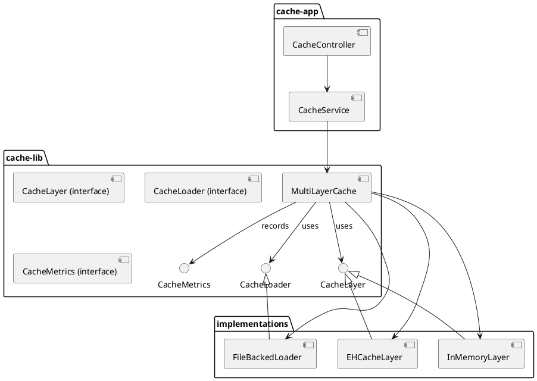

# Multi-Layer Cache — Design

This document describes the architecture, runtime flow, and metrics collection for the multi-layer cache project.

**Overview**
- Project contains two modules: `cache-lib` (library) and `cache-app` (Spring Boot demo/app).
- Key components:
  - `MultiLayerCache` — orchestrates lookups, single-flight loads, and promotions between cache layers.
  - `CacheLayer` implementations — e.g. `InMemoryLayer`, `EHCacheLayer`.
  - `CacheLoader` implementations — e.g. `FileBackedLoader` that reads CSV files.
  - `CacheMetrics` interface — collection points for hits, misses, puts, evicts and file read timing.

**Component Diagram (PlantUML)**



If PlantUML isn't rendered in your viewer, the important relationships are:
- `CacheController -> CacheService -> MultiLayerCache`
- `MultiLayerCache -> CacheLayer` (1..N)
- `MultiLayerCache -> CacheLoader` (for cold loads)
- `MultiLayerCache -> CacheMetrics` (for all metric events)

**Get Flow (Sequence)**

This sequence shows what happens when a client requests a key:

```plantuml
@startuml
actor Client
Client -> CacheController: GET /api/cache/{key}
CacheController -> CacheService: get(key)
CacheService -> MultiLayerCache: get(key)
alt key present in layer i
  MultiLayerCache -> Layer(i): get(key)
  Layer(i) --> MultiLayerCache: value
  MultiLayerCache -> CacheMetrics: recordHit(layerName)
  loop for j in 0..i-1
    MultiLayerCache -> Layer(j): put(key,value)
    MultiLayerCache -> CacheMetrics: recordPut(layerName_j)
  end
  MultiLayerCache --> CacheService: value
else not present in any layer
  MultiLayerCache -> inFlightMap: computeIfAbsent(key)
  MultiLayerCache -> CacheLoader: load(key)  
  CacheLoader --> MultiLayerCache: loadedValue
  MultiLayerCache -> CacheMetrics: recordFileRead(key)
  MultiLayerCache -> CacheMetrics: recordFileReadDuration(key, nanos)
  MultiLayerCache -> Layer*: put(key, loadedValue)
  MultiLayerCache -> CacheMetrics: recordPut(layerName)
  MultiLayerCache --> CacheService: loadedValue
end
CacheService --> CacheController: value
CacheController --> Client: 200 { value }
@enduml
```

Key notes:
- Cache lookup tries layers in priority order (index 0 highest).
- On a hit in layer i, the value is promoted to all higher-priority layers (0..i-1).
- On a miss across all layers, `CacheLoader.load` is invoked in a single-flight manner to avoid thundering herd; the result is written to all layers.

**Metrics Collection**

The `CacheMetrics` interface (see `cache-lib/src/main/java/.../CacheMetrics.java`) defines the contract for instrumentation:

- `recordHit(String layerName)` — called by `MultiLayerCache` when a layer returns a value.
- `recordMiss(String layerName)` — called when a layer lookup returns empty.
- `recordPut(String layerName)` — called whenever `MultiLayerCache` or a layer implementation writes a value.
- `recordEvict(String layerName)` — called on explicit evict operations.
- `recordFileRead(String key)` — called when `CacheLoader.load` reads from a backing source (e.g., disk).
- `recordFileReadDuration(String key, long durationNanos)` — timing for loader operations.

Recommended Micrometer mappings (example implementation):

- Counters:
  - `cache.hits{layer="<layer>"}` -> increment in `recordHit`
  - `cache.misses{layer="<layer>"}` -> increment in `recordMiss`
  - `cache.puts{layer="<layer>"}` -> increment in `recordPut`
  - `cache.evictions{layer="<layer>"}` -> increment in `recordEvict`
- File IO:
  - `cache.file.reads` -> counter per fileRead
  - `cache.file.read.duration` -> `Timer` or histogram updated from `recordFileReadDuration`

Example Java (Micrometer) sketch:

```java
class MicrometerCacheMetrics implements CacheMetrics {
  private final MeterRegistry registry;
  MicrometerCacheMetrics(MeterRegistry r) { this.registry = r; }
  void recordHit(String layer) { registry.counter("cache.hits", "layer", layer).increment(); }
  void recordMiss(String layer) { registry.counter("cache.misses", "layer", layer).increment(); }
  void recordPut(String layer) { registry.counter("cache.puts", "layer", layer).increment(); }
  void recordEvict(String layer) { registry.counter("cache.evictions", "layer", layer).increment(); }
  void recordFileRead(String key) { registry.counter("cache.file.reads").increment(); }
  void recordFileReadDuration(String key, long durationNanos) {
    Timer.builder("cache.file.read.duration").publishPercentileHistogram().register(registry).record(Duration.ofNanos(durationNanos));
  }
}
```

Placement of metrics calls (existing code):
- `MultiLayerCache.get` — calls `recordHit` / `recordMiss` for each layer lookup and `recordPut` when populating layers.
- `MultiLayerCache.loadSingleFlight` — wraps `CacheLoader.load` and calls `recordFileRead` and `recordFileReadDuration` around the loader call.

**Failure & Edge Cases**

- Loader exceptions should be propagated or translated to application-level errors; when loader fails, metrics should reflect read failures.
- Eviction/clear operations should be idempotent.
- Concurrent single-flight: the `inFlight` map prevents duplicate concurrent loads for the same key.

**Testing & Validation**

- Unit tests cover `InMemoryLayer`, `FileBackedLoader`, and `MultiLayerCache` (behavioral and TTL tests exist in `cache-lib`).
- Additional concurrency tests recommended: simulate multiple threads calling `get(key)` concurrently and assert loader invoked only once.
- Integration tests: start Spring context and register a `MicrometerCacheMetrics` bean to verify metrics exported to Prometheus.

**Extensibility**

- Add new `CacheLayer` implementations (e.g., Redis, Caffeine) implementing `CacheLayer` interface.
- Add `CacheMetrics` implementations to adapt to different observability backends.

---

Document created to help reviewers and maintainers understand how data flows and where to instrument. If you'd like, I can also generate PNGs from the PlantUML blocks and commit them next.

**ASCII Diagrams**

If you prefer plain ASCII diagrams that render in any editor, here are equivalent views.

Component diagram (ASCII):

```
+------------------------------------------------------------+
|                       java-multi-layer-cache              |
|  +----------------------+      +------------------------+  |
|  |      cache-app       |      |       cache-lib        |  |
|  |  +---------------+   |      |  +------------------+  |  |
|  |  | CacheController|--+----->|->| MultiLayerCache   |--|-----> [CacheLayer impls]
|  |  +---------------+   |      |  +------------------+  |  |
|  |  | CacheService  |--+---+  |  |  CacheLoader       |  |  |
|  |  +---------------+   |   |  |  +------------------+  |  |
|  +----------------------+   |  +------------------------+  |
|                             |                              |
|                             +------------------------------+
+------------------------------------------------------------+

Legend:
- `cache-app` calls `CacheService` -> `MultiLayerCache` in `cache-lib`.
- `MultiLayerCache` depends on one-or-more `CacheLayer` implementations (InMemory, EHCache) and a `CacheLoader`.
```

Sequence diagram (ASCII):

```
Client -> CacheController: GET /api/cache/{key}
CacheController -> CacheService: get(key)
CacheService -> MultiLayerCache: get(key)

MultiLayerCache: for each layer in order
  Layer[i] -> MultiLayerCache: get(key) (hit?)
  if hit at i:
    MultiLayerCache -> CacheMetrics: recordHit(layer-i)
    for j in 0..i-1:
      MultiLayerCache -> Layer[j]: put(key,value)
      MultiLayerCache -> CacheMetrics: recordPut(layer-j)
    return value
  else:
    MultiLayerCache -> CacheMetrics: recordMiss(layer-i)

if miss across all layers:
  MultiLayerCache -> inFlightMap: computeIfAbsent(key)
  -> CacheLoader.load(key)
  CacheLoader -> MultiLayerCache: loadedValue
  MultiLayerCache -> CacheMetrics: recordFileRead(key)
  MultiLayerCache -> CacheMetrics: recordFileReadDuration(key, nanos)
  MultiLayerCache -> all Layers: put(key, loadedValue)
  return loadedValue

CacheService -> CacheController: value
CacheController -> Client: 200 { value }
```

ASCII Metrics mapping (quick reference):

```
Counters:
  cache.hits{layer}
  cache.misses{layer}
  cache.puts{layer}
  cache.evictions{layer}

Timers/Histo:
  cache.file.read.duration
```

